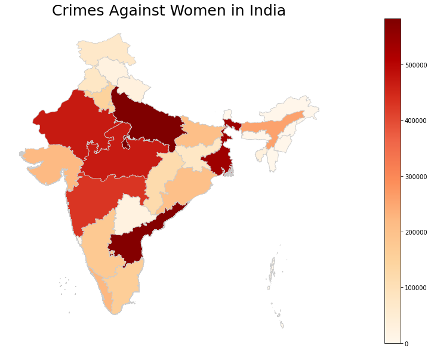

# Crimes Against Women in India

This Python project aims to visualize and analyze different crimes committed against women in India. It uses various data visualization libraries to create informative plots and charts that depict the types of crimes, geographical distribution, and trends over time. Additionally, the project includes a heatmap generated using Geopandas to provide insights into the spatial distribution of these crimes.

## Introduction

The safety and well-being of women are paramount concerns, and this project aims to shed light on crimes committed against women in India. By visualizing data related to the types and geographical distribution of these crimes, we hope to raise awareness, identify patterns, and facilitate data-driven discussions on how to address these issues effectively.

## Data Sources

1. Crime Data: This dataset contains information about different crimes against women in various regions of India. It includes details such as the type of crime, location, date, and other relevant attributes.

2. Geospatial Data: Geographic data is used to map the spatial distribution of the map of India.

## Results

The notebook can be used to visualise various charts of the different crimes. These visualizations aim to facilitate discussions, raise awareness, and assist policymakers and stakeholders in addressing these issues effectively.

The Geospatial heatmap that provides insights into crimes against women in India is as per -

<kbd>

</kbd>

- Aayush Subramaniam
